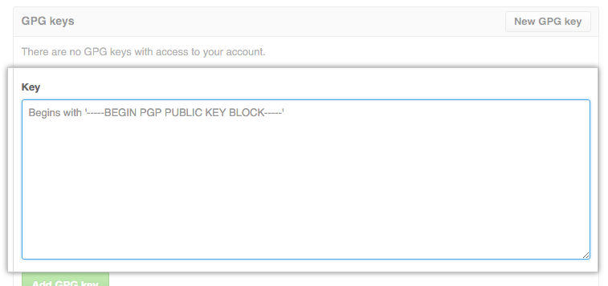

# Set-up: installing and configuring git (steps 0.1 through 0.5)

## Step 0.1: Registering a GitHub account

If you already have a GitHub account you'd like to use, log in to that account.<br>
Tip: It would be helpful to register Red Hat email id to your GitHub for easy workflow. [Add Second Email to GitHub](https://help.github.com/en/github/setting-up-and-managing-your-github-user-account/adding-an-email-address-to-your-github-account)

Otherwise, register a GitHub account at <https://github.com/>.

At the end of registration, it'll ask you to set up a new repo. You can stop there without setting one up yet.


## Step 0.2: Opening a terminal

The terminal allows you to interact with programs on your computer in a precise and powerful way. We will use it for everything in this workshop.

### Linux (Fedora and Ubuntu)

Use `ctrl` + `alt` + `T` to open a terminal or search for terminal in fedora or [search](https://askubuntu.com/questions/122437/how-to-access-applications-menu-in-ubuntu-unity-desktop) for it in the Unity dash in Ubuntu.

### MacOS

Go to Applications → Utilities → Terminal to open a terminal.

### Windows

You will be using Windows PowerShell. In the Start menu, search for PowerShell.

## Step 0.3 Checking git version

On all operating systems, enter the following command in the terminal (type the command and hit `ENTER`):<br>
`git --version`

After you enter the above command, you should see something like (although the version number may differ):<br>
`git version 2.20.1`

If you see this, it means git is installed (skip the next step). If you see nothing, git is not installed and you will need to install it, following the instructions in Step 0.4.

## Step 0.4 Installing git (if not already installed)

### Linux

#### Fedora

```
sudo dnf update
sudo dnf install git
```

#### Ubuntu

```
sudo apt-get update
sudo apt-get install git
```

### MacOS

Use the the [Git for Mac Installer](https://sourceforge.net/projects/git-osx-installer/files/).

Alternatively, if you have homebrew installed, you can issue:<br>
`brew install git`

You can [install homebrew](https://brew.sh/) with<br>
`/usr/bin/ruby -e "$(curl -fsSL https://raw.githubusercontent.com/Homebrew/install/master/install)"`<br>
before entering the above command.

### Windows

Use the [Git for Windows installer](https://gitforwindows.org/).

## Step 0.5 Configure git (if not already configured)

Configure git with your name and email. The name can be anything, but the email must match the one tied to your GitHub account (the one you used for registering the account). GitHub uses this for authentication.

On all operating systems, issue this command to check your current git configuration:<br>
`git config --list`

If the command above doesn't show your name and email, you will need to configure git. To do so, issue the following (make sure to use your real email that was used to create your GitHub account):

```
git config --global user.name "Jane Doe"
git config --global user.email "jane@redhat.com"
```

## Step 0.6 Configure SSH connection with GitHub (if not already configured)

Using the SSH protocol, you can connect and authenticate to remote servers and services. With SSH keys, you can connect to GitHub without supplying your username or password at each visit.[GitHub Docs](https://help.github.com/en/github/authenticating-to-github/connecting-to-github-with-ssh)<br>
If you don't already have an SSH key, you must generate a new SSH key. If you're unsure whether you already have an SSH key, check for existing keys.

### Check for existing keys

1. Open Terminal.
2. Enter `ls -al ~/.ssh` to see if existing SSH keys are present:

  ```
  ls -al ~/.ssh
  # Lists the files in your .ssh directory, if they exist
  ```

3. Check the directory listing to see if you already have a public SSH key. By default, the filenames of the public keys **id_rsa.pub**.

### Generate a new SSH key

1. Open Terminal
2. Paste the text below, substituting in your GitHub email address.

  ```
  ssh-keygen -t rsa -C "your_email@example.com"
  ```

3. When you're prompted to "Enter a file in which to save the key," press Enter. This accepts the default file location.

  ```
  > Enter a file in which to save the key (/home/you/.ssh/id_rsa): [Press enter]
  ```

4. At the prompt, type a secure passphrase. you can press Enter if choose to not use passphrase.

5. SSH key is now generated.

#### Setup SSH Key in GitHub

1. Copy the SSH public key present in the default location.

  ```
  /home/you/.ssh/id_rsa.pub (COPY IT)
  ```

2. [Add the SSH public key to your GitHub Account](https://help.github.com/en/github/authenticating-to-github/adding-a-new-ssh-key-to-your-github-account).

  - Goto GitHub setting.
  - From the sidebar, select **SSH and GPG keys**<br>
    
  - Add new SSH Key<br>
    
  - In the `Title` Field, add a descriptive label for the new key. For example, `Red Hat Workstation`.
  - Paste the copied SSH public key content to `Key` Field and Save.<br>
    

3. Voila! The SSH connection with GitHub is setup.

## Step 0.7 Configure commit signature with GitHub (if not already configured)

You can sign your work locally using GPG or S/MIME. GitHub will verify these signatures so other people will know that your commits come from a trusted source. GitHub will automatically sign commits you make using the GitHub web interface.[GitHub Docs](https://help.github.com/en/github/authenticating-to-github/managing-commit-signature-verification)

GitHub supports several GPG key algorithms. If you try to add a key generated with an unsupported algorithm, you may encounter an error.<br>
RSA ElGamal DSA ECDH ECDSA EdDSA

### Check for existing keys

1. open terminal.
2. Use the gpg --list-secret-keys --keyid-format LONG command to list GPG keys for which you have both a public and private key. A private key is required for signing commits or tags.

  ```
  $ gpg --list-secret-keys --keyid-format LONG
  /Users/hubot/.gnupg/secring.gpg
  ------------------------------------
  sec   4096R/3AA5C34371567BD2 2016-03-10 [expires: 2017-03-10]
  uid                          Hubot
  ssb   4096R/42B317FD4BA89E7A 2016-03-10
  ```

### Generating a new GPG key

_Note_: Before generating a new GPG key, make sure you've verified your email address.

1. Download and install the [GPG command line tools](https://www.gnupg.org/download/) for your operating system. We generally recommend installing the latest version for your operating system.

2. Open Terminal,to Generate a GPG key pair. Since there are multiple versions of GPG, you many need to consult the relevant man page to find the appropriate key generation command. Your key must use RSA.

  ```
  gpg --full-generate-key
  ```

3. At the prompt, specify the kind of key you want, or press Enter to accept the default RSA and RSA.

4. Enter the desired key size. Your key must be at least 4096 bits.

5. Enter the length of time the key should be valid. Press Enter to specify the default selection, indicating that the key doesn't expire.

6. Verify that your selections are correct.

7. Enter user Id info and secure passphrase

8. Use the `gpg --list-secret-keys --keyid-format LONG` command to list GPG keys for which you have both a public and private key. A private key is required for signing commits or tags.

  ```
  gpg --list-secret-keys --keyid-format LONG
  ```

9. From the list of GPG keys, copy the GPG key ID you'd like to use. In this example, the GPG key ID is 3AA5C34371567BD2:

  ```
  $ gpg --list-secret-keys --keyid-format LONG
  /Users/hubot/.gnupg/secring.gpg
  ------------------------------------
  sec   4096R/3AA5C34371567BD2 2016-03-10 [expires: 2017-03-10]
  uid                          Hubot
  ssb   4096R/42B317FD4BA89E7A 2016-03-10
  ```

10. Paste the text below, substituting in the GPG key ID you'd like to use. In this example, the GPG key ID is 3AA5C34371567BD2:

  ```
  $ gpg --armor --export 3AA5C34371567BD2
  # Prints the GPG key ID, in ASCII armor format
  ```

11. Copy your GPG key, beginning with -----BEGIN PGP PUBLIC KEY BLOCK----- and ending with -----END PGP PUBLIC KEY BLOCK-----.

### Adding the GPG key to GitHub

1. Goto GitHub setting.
2. From the sidebar, select **SSH and GPG keys**<br>
  
3. Add new SSH Key<br>
  
4. In the `Title` Field, add a descriptive label for the new key. For example, `Red Hat Workstation`.
5. Paste the copied GPG public key content to `Key` Field and Save.<br>
  
6. To set your GPG signing key in Git, paste the text below, substituting in the GPG key ID you'd like to use. In this example, the GPG key ID is 3AA5C34371567BD2:

  ```
  $ git config --global user.signingkey 3AA5C34371567BD2
  ```

7. Voila! The GPG key is setup with GitHub.
