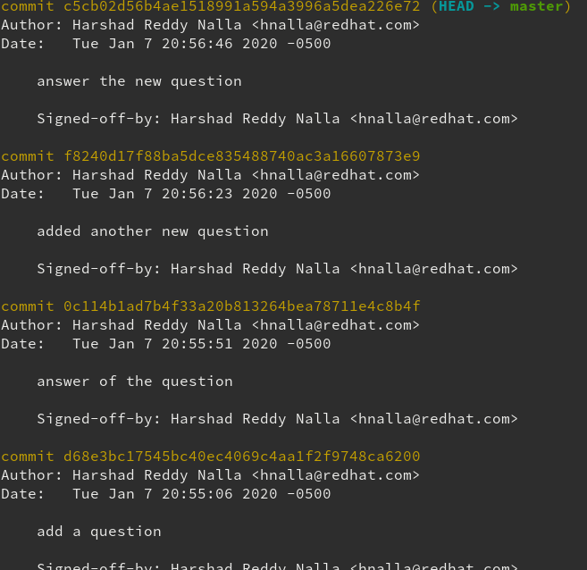
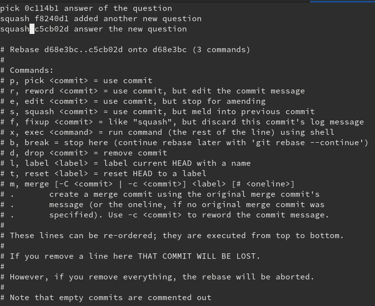

# Working with branches

## Step 3.1 Creating a new branch

To check which branch you are currently on, use:<br>
`git branch`

It should say:<br>
`* main`

To create a new branch and switch into that branch at the same time, use:<br>
`git checkout -b my-new-branch`

You should see:<br>
`Switched to a new branch 'my-new-branch'`

This new branch will be an exact copy of the branch you were on when you called the command, which in this case is `main`.

## Step 3.2 Modifying the branch

Edit `question.txt` to answer the question. Also create a file called `random.txt` inside your repo (in the same folder as `question.txt`), but feel free to leave it empty.

## Step 3.3 Committing branch changes

You will need to add the file to git's tracking before making a commit, so first view the current changes with:<br>
`git status`

You should see that you have an untracked file:

```
On branch my-new-branch
Changes not staged for commit:
  (use "git add <file>..." to update what will be committed)
  (use "git checkout -- <file>..." to discard changes in working directory)

    modified:   question.txt

Untracked files:
  (use "git add <file>..." to include in what will be committed)

    random.txt

no changes added to commit (use "git add" and/or "git commit -a")
```

Add the file with: `git add random.txt question.txt`

Check the status again with `git status` and see that it no longer shows an untracked file. You should see:

```
On branch my-new-branch
Changes to be committed:
  (use "git reset HEAD <file>..." to unstage)

    new file:   random.txt
    modified:   question.txt
```

Then you can make a commit and add a commit message:<br>
`git commit -m "answer to the question, added random file"`

The `-m` option allows you to write a message labeling the commit. Ideally, your commit message is descriptive about what changed in this commit compared to the previous one. However, it should also be short (just a few words).

You should see something like:

```
[my-new-branch 7286f7f] new question, added random file
 2 files changed, 2 insertions(+)
 create mode 100644 random.txt
```

Push your committed changes from your local machine to the remote GitHub repo, where others can see it or clone it, use:<br>
`git push origin my-new-branch`

Goto GitHub UI and check your commits.

## Step 3.4 squash commits

Lets try to add more commits to branch.

Edit `question.txt` to ask an additional question (Ex. "What is your favorite animal and why?").<br>
Check `git status` and Add `question.txt`.<br>
Use `git commit -m "<commit-message>"` to commit the changes to git.

similarly Edit `question.txt` to answer the additional question (Ex. "What is your favorite animal and why?").<br>
Check `git status` and Add `question.txt`.<br>
Use `git commit -m "<commit-message>"` to commit the changes to git.

Now, Use `git log` to check all the commits in the branch.<br>
<br>
As we see there are 3 additional commits in the git history. we would use rebase squash to squash 3 commits into 1 commit.

```
git rebase -i HEAD~3
or
git rebase -i <commit id of commit picked>
```

A nano or vi editor would be opened, with list of commits.<br>
<br>
Pick the first commit and squash the rest of it.<br>
Save it.<br>
choose the commit message for the squashed commit.<br>
Now, Use `git log` to check the commits in the git history again.

Push your committed changes from your local machine to the remote GitHub repo, where others can see it or clone it, use:<br>
`git push origin my-new-branch`

Then you should see:

```
To github.com:harshad16/myawesomerepo.git
 ! [rejected]        master -> master (non-fast-forward)
error: failed to push some refs to 'git@github.com:harshad16/myawesomerepo.git'
hint: Updates were rejected because the tip of your current branch is behind
hint: its remote counterpart. Integrate the remote changes (e.g.
hint: 'git pull ...') before pushing again.
hint: See the 'Note about fast-forwards' in 'git push --help' for details.
```

As the git history has been changed in the remote and local system. so we would have to force push it.<br>
`git push -f origin my-new-branch`

## Step 3.5 Compare branches

List the files in your directory while you're on `my-new-branch` with:<br>
`ls`

What do you see?<br>
You should see your new file, `random.txt`, as well as the older file, `question.txt`.

Now view all your branches with:<br>
`git branch`

This should show you both branches, with the current one highlighted and with an asterisk (the order in which they are listed doesn't matter):

```
main
* my-new-branch
```

To back to the `main` branch, use:<br>
`git checkout main`.

Now that you are on the original `main` branch, use `ls` again to list the files in your repo. What is different from the last time you looked at the contents of this folder?

You should see that `random.txt` has disappeared! This is expected; this file was only added in `my-new-branch` and does not show up in other branches. If you switch back to `my-new-branch` using `git checkout my-new-branch` and enter `ls`, you will see the file again.

## Step 3.6 Merging the branch

To check that you're on the `main` branch, use:<br>
`git branch`

You should see:

```
* main
my-new-branch
```

Then, to merge changes from `my-new-branch` into your current branch (`main`), use:<br>
`git merge my-new-branch`

You should see:

```
Updating 680c198..7286f7f
Fast-forward
 question.txt | 2 ++
 random.txt   | 0
 2 files changed, 2 insertions(+)
 create mode 100644 random.txt
```

Use `ls` again to see your files. You should see that now `random.txt` shows up in the `main` branch. By merging `my-new-branch` into the `main` branch, you have brought the changes from `my-new-branch` into `main`.

## Step 3.7 Push changes to remote

Push your original `main` branch to remote.

Make sure you are on the `main` branch with:<br>
`git branch`

You should see:

```
* main
my-new-branch
```

If you don't see this, you can switch to the `main` branch by using:<br>
`git checkout main`

Check that you have no untracked files with:<br>
`git status`

You should see:

```
On branch main
Your branch is ahead of 'origin/main' by 1 commit.
  (use "git push" to publish your local commits)

nothing to commit, working tree clean
```

Push the new changes to remote with: `git push origin main`

You should see:

```
Enumerating objects: 6, done.
Counting objects: 100% (6/6), done.
Delta compression using up to 8 threads
Compressing objects: 100% (3/3), done.
Writing objects: 100% (4/4), 403 bytes | 403.00 KiB/s, done.
Total 4 (delta 0), reused 0 (delta 0)
To github.com:<gitusername>/<repo>.git
   680c198..7286f7f  main -> main
```

You can check that your changes made it to remote by looking on your GitHub profile in the repo you created.

## Bonus Step

If you have extra time, delete your new branch to clean up. Make sure you are on the main branch with `git branch` (or change to master with `git checkout main`) because you cannot delete a branch you're currently on. Then delete the other branch with `git branch -d my-new-branch`. Check that the delete worked by using `git branch` to list all local branches.
